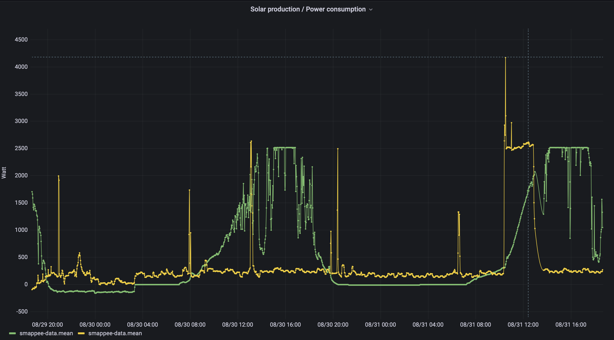

# Setting up a home energy monitoring system

## Introduction



### Goal of the project: reliable system provisioning

Apart from setting up a home energy monitoring system, the goal of this project
is to provide a set-up that can be provisioned in a reproducible way. this is achieved
by using a deployment on Raspberry Pi (4) running Ubuntu server, and by leveraging
a cloud-init configuration. The net effect is that a fully configured system will
be up and running after less than 10 minutes after the initial power-up of the
Raspberry Pi.

This repository documents the setup of a home energy monitoring system running
on a Raspberry Pi. The setup assumes that the energy data is collected via a
specific device [(Smappee Infinity)](https://www.smappee.com/infinity/) that is
wired into the home fusebox. It measures both the total electricity consumption,
the total solar panel electricity production, and individual or groups of consumers
that have been equipped with current probes.

The measurement data collected by the Smappee device can be accessed either via
a REST endpoint or via MQTT. The latter was chosen for this project.

See the presentation (PDF) for details about the setup.

Readers who want to duplicate this setup can do so (assuming they have a Smappee
device of course) by provisioning a Raspberry Pi 4 (a 3 should work too in principle
but some tweaking of the provided configuration files may be required).

This can be done by flashing an SSD using the [flash](https://github.com/eloots/flash) command.

Before doing that, copy the `cloud-init/meta-data.sample` file to `cloud-init/meta-data`
and change it as needed (user & password in particular).

Download the flash command in the Release section in [this GitHub repository](https://github.com/eloots/flash).

```
flash -n home-iot -j -m cloud-init/meta-data -u cloud-init/smappee-2-ubuntu-22-04.yml \
  https://cdimage.ubuntu.com/releases/22.04/release/ubuntu-22.04.2-preinstalled-server-arm64+raspi.img.xz
```

After flashing the SSD, connect the SSD drive to one of the USB-3 ports (blue connector)
via a USB-3 to USB-C cable (or via an USB-3 to SATA adapter if you're using a SATA drive).
Connect the Raspberry Pi to your local home network via the physical Ethernet on the Pi.
This is necessary as artefacts will be downloaded from the Internet during the initial
cloud-init configuration.

> Note that this instead of using the onboard ethernet port, you can also utilise Wifi.
> In that case you will also need to configure Wifi as part of cloud-init.

Finally, power-up the Raspberry Pi by connecting it to a power supply. The Pi should
appear on your local network after about a minute or two. Note that your LAN needs to
have a DHCP server running. This will usually be provided by your ISP router or Wifi
controller). Use `ssh` to log into the Raspberry Pi. Use the `akkapi` account with `akkapi` as password.

The cloud-init initial installation run can be followed by looking at `/var/log/cloud-init-xxx.log`

```
akkapi@node-1 $ sudo tail -f /var/log/cloud-init-*.log
```

When cloud-init finishes the initial installation, all required software should be
installed and configured! From start to finish (flash SSD till the system install is
complete) takes about seven minutes.

To finish things of, fire up a web browser and point it to your Pi's IP address and
port 3000 (for example, if your Pi get IP address `192.168.68.200`, point your browser
to  `192.168.68.200:3000`).

You should see a Grafana login page which will prompt you to set an initial password
for the `admin` account.

Once logged in, you should perform a small number of configuration steps:

- Set the InfluxDB datasources at `192.168.68.200:3000/datasources/new`
- Import the Raspberry Pi Grafana dashboard
- Import the Home Energy Monitoring dasboards

*Note that the provided Telegraf configurations and Grafana dashboards are specific
to my home setup. Hence, you will have to adapt both the Telegraf configuration
and the dashboards to fit your specific needs and configuration.*


